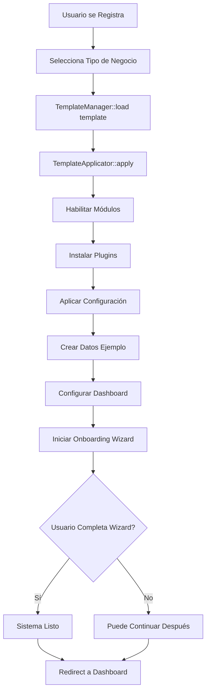

# SISTEMA DE TEMPLATES - DOCUMENTACIÓN COMPLETA Y DETALLADA

---

## ÍNDICE

1. [¿Qué son los Templates?](#1-qué-son-los-templates)
2. [Arquitectura del Sistema de Templates](#2-arquitectura-del-sistema-de-templates)
3. [Anatomía de un Template](#3-anatomía-de-un-template)
4. [Templates Disponibles](#4-templates-disponibles)
5. [Ciclo de Vida de un Template](#5-ciclo-de-vida-de-un-template)
6. [Wizard de Onboarding](#6-wizard-de-onboarding)
7. [Widgets de Dashboard](#7-widgets-de-dashboard)
8. [Configuración por Módulo](#8-configuración-por-módulo)
9. [Datos de Ejemplo](#9-datos-de-ejemplo)
10. [Creación de Nuevos Templates](#10-creación-de-nuevos-templates)
11. [Casos de Uso Reales](#11-casos-de-uso-reales)

---

## 1. ¿QUÉ SON LOS TEMPLATES?

### 1.1 Concepto

Los **Templates** (plantillas) son configuraciones **predefinidas y preempaquetadas** que permiten configurar automáticamente el sistema ERP según el tipo de negocio del cliente.

### 1.2 Problema que Resuelven

**SIN Templates:**
```
Usuario registra empresa → Sistema vacío →
Usuario debe:
1. Activar módulos manualmente
2. Configurar cada módulo
3. Instalar plugins uno por uno
4. Crear estructura de datos
5. Configurar permisos
6. Personalizar dashboard

Tiempo estimado: 2-4 horas
Tasa de abandono: 60%
Soporte requerido: Alto
```

**CON Templates:**
```
Usuario registra empresa → Selecciona "Restaurante" →
Sistema automáticamente:
1. ✅ Instala módulos necesarios
2. ✅ Configura cada módulo para restaurantes
3. ✅ Instala plugins recomendados
4. ✅ Crea datos de ejemplo (mesas, menú)
5. ✅ Configura permisos (mesero, cocinero, admin)
6. ✅ Dashboard con widgets específicos de restaurante

Tiempo estimado: 10-15 minutos
Tasa de abandono: 15%
Soporte requerido: Mínimo
```

### 1.3 Beneficios

**Para el Cliente:**
- ⚡ Configuración en minutos, no horas
- 🎯 Sistema pre-optimizado para su industria
- 📚 Aprende con datos de ejemplo relevantes
- 🚀 Productivo desde el día 1

**Para tu Empresa:**
- 💰 Menor costo de soporte
- 📈 Mayor tasa de conversión
- 😊 Clientes más satisfechos
- 🔄 Onboarding estandarizado

---

## 2. ARQUITECTURA DEL SISTEMA DE TEMPLATES

### 2.1 Componentes del Sistema

```
Sistema de Templates
│
├── Template JSON Files           # Definiciones de templates
│   ├── pos_basico.json
│   ├── pos_institucional.json
│   ├── restaurante.json
│   ├── vehicular.json
│   └── ...
│
├── TemplateManager               # Gestor principal
│   ├── load()                    # Cargar template
│   ├── apply()                   # Aplicar a tenant
│   ├── validate()                # Validar estructura
│   └── discover()                # Listar disponibles
│
├── TemplateApplicator           # Aplica configuraciones
│   ├── applyModules()
│   ├── applyPlugins()
│   ├── applySettings()
│   ├── createSampleData()
│   └── configureDashboard()
│
├── OnboardingWizard             # Wizard de configuración inicial
│   ├── steps/                   # Pasos del wizard
│   └── components/              # Componentes Livewire
│
└── DashboardConfigurator        # Configura widgets
    └── configureWidgets()
```

### 2.2 Flujo de Aplicación



### 2.3 Ubicación en el Código

```
app/
├── Core/
│   └── Template/
│       ├── TemplateManager.php          # Gestor principal
│       ├── TemplateApplicator.php       # Aplicador
│       ├── TemplateValidator.php        # Validador
│       ├── BusinessTemplates/           # Clases PHP de templates
│       │   ├── POSBasicoTemplate.php
│       │   ├── POSInstitucionalTemplate.php
│       │   ├── RestauranteTemplate.php
│       │   └── BaseTemplate.php
│       ├── Events/
│       │   ├── TemplateApplied.php
│       │   └── OnboardingCompleted.php
│       └── TemplateInterface.php
│
├── Templates/                           # Definiciones JSON
│   ├── pos_basico.json
│   ├── pos_institucional.json
│   ├── restaurante.json
│   ├── vehicular.json
│   ├── ventas_tat.json
│   └── ...
│
├── Livewire/
│   └── Onboarding/
│       ├── TemplateSelector.php         # Selector de template
│       ├── OnboardingWizard.php         # Wizard principal
│       └── Steps/                       # Pasos del wizard
│           ├── BusinessInfoStep.php
│           ├── ProductImportStep.php
│           └── ...
│
└── Http/
    └── Controllers/
        └── TemplateController.php       # API de templates
```

---

## 3. ANATOMÍA DE UN TEMPLATE

### 3.1 Estructura Completa de un Template JSON

```json
{
  // ===== METADATOS =====
  "id": "string",                        // Identificador único
  "name": "string",                      // Nombre visible
  "description": "string",               // Descripción detallada
  "icon": "string",                      // Ícono (heroicons, fontawesome)
  "version": "1.0.0",                    // Versión del template
  "target_business": ["array"],          // Tipos de negocio
  "difficulty": "beginner|intermediate|advanced",
  "category": "string",                  // retail, services, manufacturing

  // ===== MÓDULOS =====
  "included_modules": [                  // Módulos que se activan
    "string"
  ],

  // ===== PLUGINS =====
  "required_plugins": [                  // Plugins obligatorios
    {
      "plugin": "string",
      "required": true,
      "features": ["array"]
    }
  ],
  "recommended_plugins": [               // Plugins opcionales
    {
      "plugin": "string",
      "connectors": ["array"],
      "optional": true,
      "highlight": "string",
      "priority": 1
    }
  ],

  // ===== CONFIGURACIÓN =====
  "pre_configuration": {                 // Config de cada módulo
    "module_name": {
      "setting_key": "value"
    }
  },

  // ===== ONBOARDING =====
  "onboarding_wizard": {
    "enabled": true,
    "skip_allowed": false,
    "steps": [                           // Pasos del wizard
      {
        "id": "string",
        "title": "string",
        "description": "string",
        "component": "string",
        "fields": [],
        "actions": [],
        "completion_percentage": 20
      }
    ]
  },

  // ===== DASHBOARD =====
  "dashboard_widgets": [                 // Widgets del dashboard
    {
      "id": "string",
      "name": "string",
      "component": "string",
      "position": {"row": 1, "col": 1},
      "size": {"width": 1, "height": 1},
      "config": {},
      "refresh_interval": 60000
    }
  ],

  // ===== DATOS DE EJEMPLO =====
  "sample_data": {
    "categories": [],
    "products": [],
    "customers": [],
    "tables": []
  },

  // ===== PRICING =====
  "pricing": {
    "monthly": 9.99,
    "annual": 99.00,
    "currency": "USD",
    "trial_days": 15,
    "features_included": ["array"]
  },

  // ===== RECURSOS =====
  "help_resources": {
    "video_tutorial": "url",
    "documentation": "url",
    "community_forum": "url"
  }
}
```

### 3.2 Ejemplo Mínimo (Template Básico)

```json
{
  "id": "tienda_basica",
  "name": "Tienda Básica",
  "description": "Para tiendas pequeñas sin complicaciones",
  "icon": "shopping-bag",

  "included_modules": [
    "dashboard",
    "pos",
    "inventory",
    "customers"
  ],

  "pre_configuration": {
    "pos": {
      "tax_included_in_price": true,
      "require_customer_on_sale": false
    }
  },

  "onboarding_wizard": {
    "enabled": true,
    "steps": [
      {
        "id": "business_info",
        "title": "Datos de tu Tienda",
        "component": "BusinessInfoStep",
        "fields": [
          {"name": "business_name", "type": "text", "required": true}
        ],
        "completion_percentage": 100
      }
    ]
  },

  "pricing": {
    "monthly": 5.99
  }
}
```

### 3.3 Ejemplo Completo (Template Restaurante)

Este ya lo viste en la documentación, pero aquí están los puntos clave:

**Características Especiales:**
- Requiere plugin `pos-restaurant`
- Configuración específica: `table_management`, `kitchen_display`
- Wizard personalizado: diseño de mesas, creación de menú
- Widgets especiales: estado de mesas, cola de cocina
- Datos ejemplo: categorías de comida, platillos, mesas

---

## 4. TEMPLATES DISPONIBLES

### 4.1 POS Básico - Tienda Pequeña

**Perfil del Cliente:**
- Mini-markets
- Tiendas de barrio
- Papelerías
- Farmacias pequeñas
- Ventas al detal

**Módulos Incluidos:**
```
✅ Dashboard
✅ POS
✅ Inventario (básico)
✅ Clientes (básico)
✅ Facturación simple
✅ Caja
```

**Configuración Pre-establecida:**
```json
{
  "pos": {
    "sucursales_limit": 2,
    "bodegas_per_sucursal": 2,
    "usuarios_per_sucursal": 4,
    "control_serial": false,
    "allow_negative_stock": false,
    "require_customer_on_sale": false,
    "default_payment_method": "cash",
    "tax_included_in_price": true,
    "default_tax_rate": 0
  },
  "inventory": {
    "multi_warehouse": false,
    "batch_control": false,
    "serial_control": false,
    "low_stock_alert": true,
    "low_stock_threshold": 5,
    "valuation_method": "average_cost"
  },
  "billing": {
    "electronic": false,
    "types": ["factura_simple", "nota_credito"],
    "numeration_prefix": "F",
    "auto_increment": true
  }
}
```

**Plugins Recomendados:**
1. **Payment Gateways** (opcional)
   - Conectores: Wompi, Nequi, Daviplata
   - Beneficio: Pagos con QR

2. **WhatsApp Integration** (opcional)
   - Beneficio: Envío de facturas

3. **Billing Electronic** (opcional - premium)
   - Beneficio: Facturación DIAN

**Wizard de Onboarding (4 pasos):**
```
Paso 1: Información del Negocio (20%)
  - Nombre, NIT, dirección, teléfono

Paso 2: Configurar Caja (40%)
  - Nombre de caja, monto inicial

Paso 3: Agregar Productos (60%) [OPCIONAL]
  - Importar Excel
  - Crear manualmente
  - Usar datos de ejemplo

Paso 4: Métodos de Pago (80%)
  - Efectivo, tarjetas, transferencia

Paso 5: Primera Venta (100%)
  - Demo de venta
```

**Dashboard Widgets:**
- Ventas de Hoy
- Estado de Caja
- Productos Más Vendidos
- Alertas de Stock Bajo
- Botón Venta Rápida

**Precio:** $9.99/mes

---

### 4.2 POS Institucional - Distribuidora

**Perfil del Cliente:**
- Distribuidoras
- Mayoristas
- Empresas medianas
- Múltiples sucursales

**Módulos Incluidos:**
```
✅ Dashboard
✅ POS
✅ Inventario (avanzado)
✅ Clientes (completo con crédito)
✅ Proveedores
✅ Facturación
✅ Compras
✅ Contabilidad básica
✅ Caja
✅ Reportes
```

**Configuración Pre-establecida:**
```json
{
  "pos": {
    "multi_sucursales": true,
    "sucursales_limit": null,                    // Ilimitadas
    "bodegas_per_sucursal": 5,
    "usuarios_per_sucursal": null,               // Ilimitados
    "control_serial": true,
    "batch_control": true,
    "allow_negative_stock": false,
    "require_customer_on_sale": true,
    "credit_sales_enabled": true,
    "quotation_enabled": true,
    "remission_enabled": true,
    "composite_invoice": true                    // Factura desde múltiples remisiones
  },
  "inventory": {
    "multi_warehouse": true,
    "batch_control": true,
    "serial_control": true,
    "expiration_control": true,
    "transfer_between_warehouses": true,
    "transfer_approval_required": true,
    "inventory_count_required": "monthly",
    "valuation_method": "fifo"
  },
  "billing": {
    "electronic": true,
    "types": [
      "factura",
      "factura_electronica",
      "nota_credito",
      "nota_debito",
      "remision",
      "cotizacion"
    ],
    "numeration_by_branch": true,
    "resolution_control": true
  },
  "purchasing": {
    "purchase_orders_enabled": true,
    "purchase_approval_required": true,
    "approval_amount_threshold": 5000000,
    "supplier_evaluation": true
  },
  "customers": {
    "require_tax_id": true,
    "credit_management": true,
    "credit_limit_check": true,
    "aging_report": true,
    "customer_categories": ["VIP", "Regular", "Nuevo"]
  }
}
```

**Plugins Recomendados:**
1. **Billing Electronic** (casi obligatorio)
   - DIAN Colombia, SUNAT Perú
2. **Accounting Premium**
   - Estados financieros
3. **Advanced Reports**
   - BI y reportes personalizables

**Wizard de Onboarding (6 pasos):**
```
Paso 1: Información de la Empresa (10%)
  - Datos legales completos
  - NIT, régimen, dirección legal

Paso 2: Configurar Sucursales (25%)
  - Crear sucursales
  - Asignar responsables

Paso 3: Configurar Bodegas (40%)
  - Bodegas por sucursal
  - Ubicaciones

Paso 4: Usuarios y Roles (60%)
  - Crear usuarios
  - Asignar roles y permisos

Paso 5: Configurar Facturación (80%)
  - Habilitar FE
  - Configurar DIAN

Paso 6: Importar Datos (100%)
  - Productos (Excel)
  - Clientes (Excel)
  - Proveedores (Excel)
```

**Dashboard Widgets:**
- Ventas por Sucursal
- Valorización de Inventario
- Aprobaciones Pendientes
- Cartera por Cobrar
- Mejores Clientes
- Stock Bajo por Bodega
- Comisiones de Vendedores

**Precio:** $79.99/mes + $10/usuario adicional + $20/sucursal adicional

---

### 4.3 Restaurante / Cafetería

**Perfil del Cliente:**
- Restaurantes
- Cafeterías
- Bares
- Food trucks
- Comida rápida

**Módulos Incluidos:**
```
✅ Dashboard
✅ POS
✅ Inventario (con recetas)
✅ Clientes (básico)
✅ Facturación
✅ Caja
```

**Plugin REQUERIDO:**
```
pos-restaurant (obligatorio)
  - Gestión de mesas y zonas
  - Comandas a cocina
  - División de cuentas
  - Propinas
  - Control de turnos
  - Modificadores de platillos
```

**Configuración Pre-establecida:**
```json
{
  "pos_restaurant": {
    "table_management": true,
    "kitchen_display": true,
    "split_bills": true,                         // Dividir cuenta
    "tips_enabled": true,
    "suggested_tip_percentages": [10, 15, 20],
    "zones": ["Terraza", "Interior", "Barra"],
    "table_prefix": "Mesa",
    "auto_print_kitchen": true,
    "preparation_time_tracking": true
  },
  "inventory": {
    "recipe_management": true,                    // Recetas
    "ingredient_tracking": true,                  // Control ingredientes
    "portion_control": true,                      // Control porciones
    "waste_tracking": true                        // Mermas
  },
  "pos": {
    "require_customer_on_sale": false,
    "allow_modifiers": true,                      // Sin cebolla, extra queso
    "allow_discounts": true,
    "max_discount_percent": 20,
    "service_charge_enabled": false
  }
}
```

**Plugins Recomendados:**
1. **Delivery Management** (para domicilios)
2. **WhatsApp Integration** (recibir pedidos)
3. **Payment Gateways** (pagos online)

**Wizard de Onboarding (5 pasos):**
```
Paso 1: Información del Restaurante (15%)
  - Nombre, tipo de cocina
  - Capacidad, teléfono

Paso 2: Configurar Mesas y Zonas (30%)
  - Diseñador drag & drop
  - Zonas: Terraza, Interior, Barra
  - Capacidad por mesa

Paso 3: Crear Menú (60%)
  - Categorías (Entradas, Platos, Postres, Bebidas)
  - Platillos con modificadores
  - Combos
  - Recetas con ingredientes

Paso 4: Configurar Cocina (80%)
  - Impresoras de cocina
  - Estaciones (Fría, Caliente, Bar)
  - Tiempos de preparación

Paso 5: Configurar Personal (100%)
  - Crear usuarios
  - Roles: Mesero, Cajero, Cocina, Admin
```

**Dashboard Widgets:**
- Estado de Mesas (visual)
- Órdenes Activas
- Cola de Cocina
- Ingresos del Día
- Platillos Populares
- Desempeño de Meseros

**Datos de Ejemplo:**
```json
{
  "categories": [
    {"name": "Entradas", "icon": "🥗"},
    {"name": "Platos Fuertes", "icon": "🍽️"},
    {"name": "Postres", "icon": "🍰"},
    {"name": "Bebidas", "icon": "🥤"}
  ],
  "products": [
    {
      "name": "Ensalada César",
      "category": "Entradas",
      "price": 15000,
      "cost": 8000,
      "preparation_time": 10,
      "modifiers": ["Sin cebolla", "Extra pollo"],
      "recipe": {
        "ingredients": [
          {"item": "Lechuga", "quantity": 100, "unit": "g"},
          {"item": "Pollo", "quantity": 150, "unit": "g"},
          {"item": "Salsa César", "quantity": 50, "unit": "ml"}
        ]
      }
    }
  ],
  "tables": [
    {"number": 1, "zone": "Interior", "capacity": 4},
    {"number": 2, "zone": "Interior", "capacity": 2},
    {"number": 3, "zone": "Terraza", "capacity": 6}
  ]
}
```

**Precio:** $29.99/mes

---

### 4.4 Vehicular / Taller Automotriz

**Perfil del Cliente:**
- Talleres mecánicos
- Talleres de pintura
- Concesionarios
- Venta de repuestos

**Módulos Incluidos:**
```
✅ Dashboard
✅ Inventario (repuestos)
✅ Clientes (con vehículos)
✅ Servicios
✅ Facturación
✅ Caja
```

**Plugin REQUERIDO:**
```
vehicle-management (obligatorio)
  - Registro de vehículos
  - Historial de servicios
  - Órdenes de trabajo
  - Control de técnicos
  - Checklist por servicio
```

**Configuración Pre-establecida:**
```json
{
  "vehicle_management": {
    "vehicle_registration": true,
    "service_history": true,
    "work_orders": true,
    "technician_assignment": true,
    "service_checklist": true,
    "parts_tracking": true,
    "labor_time_tracking": true
  },
  "inventory": {
    "track_serial": true,                         // Seriales de repuestos
    "parts_compatibility": true,                  // Compatible con vehículos
    "supplier_part_numbers": true
  },
  "services": {
    "service_packages": true,                     // Paquetes de servicios
    "labor_rates": true,                          // Tarifas mano de obra
    "estimated_time": true
  },
  "customers": {
    "vehicle_tracking": true,
    "service_reminders": true,                    // Recordatorios de servicio
    "sms_notifications": true
  }
}
```

**Wizard de Onboarding:**
```
Paso 1: Información del Taller (20%)
  - Nombre, especialidad
  - Servicios que ofrece

Paso 2: Configurar Servicios (40%)
  - Crear servicios (Cambio aceite, Alineación, etc.)
  - Tarifas mano de obra
  - Tiempo estimado

Paso 3: Importar Repuestos (60%)
  - Excel con repuestos
  - Compatibilidad con vehículos

Paso 4: Configurar Técnicos (80%)
  - Crear usuarios técnicos
  - Especialidades

Paso 5: Primer Vehículo (100%)
  - Registrar vehículo de ejemplo
  - Crear orden de trabajo
```

**Dashboard Widgets:**
- Órdenes de Trabajo Activas
- Vehículos en Taller
- Técnicos Disponibles
- Servicios Pendientes
- Ingresos del Día
- Repuestos Más Vendidos
- Próximos Servicios Programados

**Precio:** $39.99/mes

---

### 4.5 Ventas TAT (Por Catálogo)

**Perfil del Cliente:**
- Venta por catálogo
- Multinivel
- Representantes de ventas
- Distribución directa

**Módulos Incluidos:**
```
✅ Dashboard
✅ Catálogo de Productos
✅ Órdenes de Venta
✅ Clientes
✅ Comisiones
✅ Inventario
```

**Configuración Especial:**
```json
{
  "catalog": {
    "digital_catalog": true,
    "product_images_required": true,
    "price_lists": true,                          // Múltiples listas de precio
    "volume_discounts": true
  },
  "sales": {
    "sales_representatives": true,
    "commission_tracking": true,
    "team_hierarchy": true,                       // Estructura multinivel
    "order_approval_required": true
  },
  "delivery": {
    "shipping_zones": true,
    "delivery_tracking": true,
    "delivery_fee_calculation": true
  }
}
```

**Precio:** $24.99/mes

---

### 4.6 Servicios a Domicilio

**Perfil del Cliente:**
- Delivery
- Servicios técnicos
- Limpieza
- Mantenimiento

**Plugin REQUERIDO:**
```
delivery-management
  - Gestión de pedidos
  - Asignación de repartidores
  - Tracking GPS
  - Zonas de cobertura
  - Cálculo de rutas
```

**Precio:** $19.99/mes

---

### 4.7 Producción / Manufactura

**Perfil del Cliente:**
- Manufactura
- Transformación
- Ensamble
- Producción por lotes

**Plugin REQUERIDO:**
```
production-management
  - Órdenes de producción
  - BOM (Bill of Materials)
  - Control de materia prima
  - Control de calidad
  - Trazabilidad
```

**Precio:** $49.99/mes

---

## 5. CICLO DE VIDA DE UN TEMPLATE

### 5.1 Flujo Completo

```
1. SELECCIÓN
   └─> Usuario ve catálogo de templates
       └─> Compara características
           └─> Selecciona el que mejor se ajusta

2. REGISTRO
   └─> Usuario crea cuenta
       └─> Sistema crea tenant
           └─> Asocia template seleccionado

3. APLICACIÓN AUTOMÁTICA
   └─> TemplateManager carga JSON
       └─> TemplateApplicator::apply()
           ├─> Habilita módulos
           ├─> Instala plugins
           ├─> Aplica configuración
           ├─> Crea datos de ejemplo
           └─> Configura dashboard

4. ONBOARDING WIZARD
   └─> Usuario completa pasos guiados
       └─> Personaliza configuración
           └─> Carga sus datos reales

5. SISTEMA LISTO
   └─> Usuario puede usar el sistema
       └─> Todo pre-configurado
           └─> Datos de ejemplo para aprender
```

### 5.2 Código del Flujo

**1. Selector de Template (Componente Livewire)**

```php
<?php

namespace App\Livewire\Onboarding;

use Livewire\Component;
use App\Core\Template\TemplateManager;

class TemplateSelector extends Component
{
    public $templates = [];
    public $selectedTemplate = null;

    public function mount()
    {
        $this->templates = app(TemplateManager::class)->all();
    }

    public function selectTemplate($templateId)
    {
        $this->selectedTemplate = $templateId;

        // Guardar en sesión
        session(['selected_template' => $templateId]);

        // Continuar al registro
        return redirect()->route('register');
    }

    public function render()
    {
        return view('livewire.onboarding.template-selector');
    }
}
```

**Vista del Selector:**

```blade
<div class="template-selector">
    <h1>¿Qué tipo de negocio tienes?</h1>

    <div class="templates-grid">
        @foreach($templates as $template)
            <div class="template-card {{ $selectedTemplate === $template['id'] ? 'selected' : '' }}"
                 wire:click="selectTemplate('{{ $template['id'] }}')">

                <div class="icon">
                    <x-icon :name="$template['icon']" />
                </div>

                <h3>{{ $template['name'] }}</h3>
                <p>{{ $template['description'] }}</p>

                <div class="features">
                    <p><strong>Incluye:</strong></p>
                    <ul>
                        @foreach($template['included_modules'] as $module)
                            <li>{{ ucfirst($module) }}</li>
                        @endforeach
                    </ul>
                </div>

                <div class="pricing">
                    <strong>${{ $template['pricing']['monthly'] }}/mes</strong>
                    @if($template['pricing']['trial_days'])
                        <span>{{ $template['pricing']['trial_days'] }} días gratis</span>
                    @endif
                </div>

                <button class="btn-select">
                    Seleccionar
                </button>
            </div>
        @endforeach
    </div>
</div>
```

**2. Aplicación del Template (al crear tenant)**

```php
<?php

namespace App\Console\Commands;

use App\Core\Tenant\TenantManager;
use App\Core\Template\TemplateManager;

class CreateTenantCommand extends Command
{
    public function handle()
    {
        // ... código de creación de tenant ...

        // Aplicar template si existe
        $templateId = $this->option('template') ?? session('selected_template');

        if ($templateId) {
            $this->info("Aplicando template: {$templateId}");

            $templateManager = app(TemplateManager::class);
            $template = $templateManager->load($templateId);

            if ($template) {
                $templateManager->apply($template, $tenant);

                $this->info("✅ Template aplicado exitosamente");
            }
        }
    }
}
```

**3. Wizard de Onboarding (Componente Livewire)**

```php
<?php

namespace App\Livewire\Onboarding;

use Livewire\Component;
use App\Core\Template\TemplateManager;

class OnboardingWizard extends Component
{
    public $currentStep = 0;
    public $steps = [];
    public $stepData = [];
    public $tenant;

    public function mount()
    {
        $this->tenant = session('current_tenant');

        // Cargar pasos del template aplicado
        $templateId = $this->tenant->settings['applied_template'] ?? null;

        if ($templateId) {
            $template = app(TemplateManager::class)->load($templateId);
            $this->steps = $template['onboarding_wizard']['steps'];
        }
    }

    public function nextStep()
    {
        // Validar paso actual
        $this->validateCurrentStep();

        // Guardar datos
        $this->saveStepData();

        // Avanzar
        if ($this->currentStep < count($this->steps) - 1) {
            $this->currentStep++;
        } else {
            // Completar onboarding
            $this->completeOnboarding();
        }
    }

    public function previousStep()
    {
        if ($this->currentStep > 0) {
            $this->currentStep--;
        }
    }

    public function skipOnboarding()
    {
        if ($this->steps[$this->currentStep]['optional'] ?? false) {
            $this->currentStep++;
        }
    }

    protected function validateCurrentStep()
    {
        $step = $this->steps[$this->currentStep];

        // Validar campos del paso
        if (isset($step['fields'])) {
            $rules = [];
            foreach ($step['fields'] as $field) {
                if ($field['required'] ?? false) {
                    $rules["stepData.{$this->currentStep}.{$field['name']}"] = 'required';
                }
            }

            $this->validate($rules);
        }
    }

    protected function saveStepData()
    {
        // Guardar en BD o ejecutar acciones según el paso
        $step = $this->steps[$this->currentStep];
        $component = $step['component'];

        // Llamar al componente específico para guardar
        $componentClass = "App\\Livewire\\Onboarding\\Steps\\{$component}";

        if (class_exists($componentClass)) {
            $instance = new $componentClass();
            $instance->save($this->stepData[$this->currentStep] ?? []);
        }
    }

    protected function completeOnboarding()
    {
        app(TemplateManager::class)->completeOnboarding($this->tenant);

        session()->flash('success', '¡Configuración completada! Tu sistema está listo.');

        return redirect()->route('tenant.dashboard');
    }

    public function render()
    {
        $currentStepData = $this->steps[$this->currentStep] ?? null;

        return view('livewire.onboarding.wizard', [
            'step' => $currentStepData,
            'progress' => $currentStepData['completion_percentage'] ?? 0
        ]);
    }
}
```

---

## 6. WIZARD DE ONBOARDING

### 6.1 Componentes de Pasos

Cada paso del wizard es un componente Livewire independiente:

```php
<?php

namespace App\Livewire\Onboarding\Steps;

use Livewire\Component;

class BusinessInfoStep extends Component
{
    public $business_name = '';
    public $nit = '';
    public $address = '';
    public $phone = '';
    public $email = '';

    public function save($data)
    {
        // Guardar información del negocio en settings del tenant
        $tenant = tenancy()->tenant;

        $settings = $tenant->settings ?? [];
        $settings['business_info'] = [
            'name' => $data['business_name'],
            'nit' => $data['nit'],
            'address' => $data['address'],
            'phone' => $data['phone'],
            'email' => $data['email'],
        ];

        $tenant->update(['settings' => $settings]);
    }

    public function render()
    {
        return view('livewire.onboarding.steps.business-info');
    }
}
```

### 6.2 Paso Especial: Table Layout Designer (Restaurante)

```php
<?php

namespace App\Livewire\Onboarding\Steps;

use Livewire\Component;

class TableLayoutDesigner extends Component
{
    public $zones = [];
    public $tables = [];

    public function mount()
    {
        $template = app(\App\Core\Template\TemplateManager::class)
            ->load(session('applied_template'));

        $this->zones = $template['pre_configuration']['pos_restaurant']['zones'] ?? [];
    }

    public function addTable($zone)
    {
        $this->tables[] = [
            'id' => uniqid(),
            'zone' => $zone,
            'number' => count($this->tables) + 1,
            'capacity' => 4,
            'x' => 0,
            'y' => 0,
        ];
    }

    public function updateTablePosition($tableId, $x, $y)
    {
        $index = collect($this->tables)->search(fn($t) => $t['id'] === $tableId);

        if ($index !== false) {
            $this->tables[$index]['x'] = $x;
            $this->tables[$index]['y'] = $y;
        }
    }

    public function save($data)
    {
        // Guardar mesas en BD del tenant
        foreach ($this->tables as $table) {
            DB::table('restaurant_tables')->insert([
                'number' => $table['number'],
                'zone' => $table['zone'],
                'capacity' => $table['capacity'],
                'position_x' => $table['x'],
                'position_y' => $table['y'],
                'status' => 'available',
                'created_at' => now(),
            ]);
        }
    }

    public function render()
    {
        return view('livewire.onboarding.steps.table-layout-designer');
    }
}
```

**Vista con Drag & Drop:**

```blade
<div class="table-layout-designer">
    <div class="zones-sidebar">
        <h3>Zonas</h3>
        @foreach($zones as $zone)
            <button wire:click="addTable('{{ $zone }}')" class="add-table-btn">
                + Agregar Mesa en {{ $zone }}
            </button>
        @endforeach
    </div>

    <div class="canvas" id="layout-canvas">
        @foreach($tables as $table)
            <div class="table-item draggable"
                 data-id="{{ $table['id'] }}"
                 style="left: {{ $table['x'] }}px; top: {{ $table['y'] }}px;">

                <div class="table-number">{{ $table['number'] }}</div>
                <div class="table-zone">{{ $table['zone'] }}</div>
                <div class="table-capacity">{{ $table['capacity'] }} personas</div>
            </div>
        @endforeach
    </div>
</div>

@script
<script>
    // Implementar drag & drop con interact.js o similar
    interact('.draggable').draggable({
        onmove: function(event) {
            var target = event.target;
            var x = (parseFloat(target.getAttribute('data-x')) || 0) + event.dx;
            var y = (parseFloat(target.getAttribute('data-y')) || 0) + event.dy;

            target.style.transform = 'translate(' + x + 'px, ' + y + 'px)';
            target.setAttribute('data-x', x);
            target.setAttribute('data-y', y);
        },
        onend: function(event) {
            var tableId = event.target.getAttribute('data-id');
            var x = parseFloat(event.target.getAttribute('data-x'));
            var y = parseFloat(event.target.getAttribute('data-y'));

            @this.updateTablePosition(tableId, x, y);
        }
    });
</script>
@endscript
```

---

## 7. WIDGETS DE DASHBOARD

### 7.1 Configuración Dinámica

Los widgets del dashboard se configuran automáticamente según el template:

```php
<?php

namespace App\Core\Template;

class TemplateManager
{
    protected function configureDashboard(array $widgets, Tenant $tenant): void
    {
        $tenant->run(function () use ($widgets) {
            // Limpiar widgets existentes
            DB::table('dashboard_widgets')->truncate();

            // Insertar widgets del template
            foreach ($widgets as $widget) {
                DB::table('dashboard_widgets')->insert([
                    'widget_id' => $widget['id'],
                    'name' => $widget['name'],
                    'component' => $widget['component'],
                    'position' => json_encode($widget['position']),
                    'size' => json_encode($widget['size']),
                    'config' => json_encode($widget['config'] ?? []),
                    'refresh_interval' => $widget['refresh_interval'] ?? null,
                    'is_active' => true,
                    'created_at' => now(),
                    'updated_at' => now(),
                ]);
            }
        });
    }
}
```

### 7.2 Ejemplo de Widget: TableStatusWidget (Restaurante)

```php
<?php

namespace App\Livewire\Widgets;

use Livewire\Component;
use Illuminate\Support\Facades\DB;

class TableStatusWidget extends Component
{
    public $config = [];
    public $tables = [];

    // Actualizar cada 30 segundos
    protected $listeners = ['refresh-widget' => '$refresh'];

    public function mount($config = [])
    {
        $this->config = $config;
        $this->loadTables();
    }

    protected function loadTables()
    {
        $this->tables = DB::table('restaurant_tables')
            ->select('*')
            ->get()
            ->groupBy('zone');
    }

    public function render()
    {
        return view('livewire.widgets.table-status', [
            'colors' => $this->config['colors'] ?? [
                'available' => 'green',
                'occupied' => 'red',
                'reserved' => 'yellow'
            ]
        ]);
    }
}
```

**Vista del Widget:**

```blade
<div class="widget table-status">
    <h3>{{ $name }}</h3>

    @foreach($tables as $zone => $zoneTables)
        <div class="zone">
            <h4>{{ $zone }}</h4>

            <div class="tables-grid">
                @foreach($zoneTables as $table)
                    <div class="table-card status-{{ $table->status }}"
                         style="background-color: {{ $colors[$table->status] ?? 'gray' }}">

                        <div class="table-number">{{ $table->number }}</div>
                        <div class="table-capacity">{{ $table->capacity }} pers.</div>
                        <div class="table-status">{{ ucfirst($table->status) }}</div>
                    </div>
                @endforeach
            </div>
        </div>
    @endforeach
</div>
```

---

## 8. CONFIGURACIÓN POR MÓDULO

Cada módulo puede tener configuraciones específicas según el template:

### 8.1 Estructura de Configuración

```json
{
  "pre_configuration": {
    "nombre_modulo": {
      "setting_key": "value",
      "otra_setting": true,
      "configuracion_compleja": {
        "nested": "value"
      }
    }
  }
}
```

### 8.2 Cómo se Aplica la Configuración

```php
<?php

namespace App\Core\Template;

class TemplateApplicator
{
    protected function applyConfiguration(array $config, Tenant $tenant): void
    {
        $tenant->run(function () use ($config) {
            foreach ($config as $moduleSlug => $moduleConfig) {
                // Guardar en tabla module_settings
                DB::table('module_settings')->updateOrInsert(
                    ['module' => $moduleSlug],
                    [
                        'config' => json_encode($moduleConfig),
                        'updated_at' => now()
                    ]
                );
            }
        });
    }
}
```

### 8.3 Cómo los Módulos Leen su Configuración

```php
<?php

namespace App\Modules\POS\Services;

class POSConfigService
{
    public function getConfig(string $key, $default = null)
    {
        $config = DB::table('module_settings')
            ->where('module', 'pos')
            ->value('config');

        if (!$config) {
            return $default;
        }

        $settings = json_decode($config, true);

        return data_get($settings, $key, $default);
    }

    public function requireCustomerOnSale(): bool
    {
        return $this->getConfig('require_customer_on_sale', false);
    }

    public function taxIncludedInPrice(): bool
    {
        return $this->getConfig('tax_included_in_price', false);
    }

    public function maxDiscount(): float
    {
        return $this->getConfig('max_discount_percent', 0);
    }
}
```

### 8.4 Ejemplo de Uso en Código

```php
<?php

namespace App\Modules\POS\Livewire;

use App\Modules\POS\Services\POSConfigService;

class POSScreen extends Component
{
    public function mount()
    {
        $config = app(POSConfigService::class);

        // Leer configuración del template aplicado
        $this->requireCustomer = $config->requireCustomerOnSale();
        $this->taxIncluded = $config->taxIncludedInPrice();
        $this->maxDiscount = $config->maxDiscount();
    }
}
```

---

## 9. DATOS DE EJEMPLO

### 9.1 Propósito

Los datos de ejemplo sirven para:
1. ✅ Que el usuario aprenda el sistema con datos relevantes
2. ✅ Hacer demos sin tener que crear todo manualmente
3. ✅ Mostrar cómo debería verse el sistema configurado
4. ✅ Reducir tiempo de onboarding

### 9.2 Aplicación de Datos de Ejemplo

```php
<?php

namespace App\Core\Template;

class TemplateManager
{
    protected function createSampleData(array $data, Tenant $tenant): void
    {
        $tenant->run(function () use ($data) {
            // Crear categorías
            if (isset($data['categories'])) {
                foreach ($data['categories'] as $categoryData) {
                    \App\Modules\Inventory\Models\Category::create($categoryData);
                }
            }

            // Crear productos
            if (isset($data['products'])) {
                foreach ($data['products'] as $productData) {
                    // Resolver categoría por nombre
                    if (isset($productData['category'])) {
                        $category = \App\Modules\Inventory\Models\Category::where('name', $productData['category'])->first();
                        $productData['category_id'] = $category?->id;
                        unset($productData['category']);
                    }

                    \App\Modules\Inventory\Models\Product::create($productData);
                }
            }

            // Crear clientes
            if (isset($data['customers'])) {
                foreach ($data['customers'] as $customerData) {
                    \App\Modules\CRM\Models\Customer::create($customerData);
                }
            }

            // Crear mesas (para restaurantes)
            if (isset($data['tables'])) {
                foreach ($data['tables'] as $tableData) {
                    DB::table('restaurant_tables')->insert($tableData);
                }
            }

            // Crear datos específicos por template
            if (isset($data['custom'])) {
                $this->createCustomSampleData($data['custom']);
            }
        });
    }
}
```

### 9.3 Datos de Ejemplo Inteligentes

Los datos de ejemplo pueden ser **específicos del país** o **industria**:

```json
{
  "sample_data": {
    "country_specific": true,
    "country": "CO",

    "categories": [
      {
        "name": "Abarrotes",
        "description": "Productos de primera necesidad",
        "popular_in": ["CO", "MX", "PE"]
      },
      {
        "name": "Bebidas",
        "description": "Refrescos y bebidas",
        "popular_in": ["*"]
      }
    ],

    "products": [
      {
        "name": "Arroz Diana 500g",
        "code": "ARR500",
        "category": "Abarrotes",
        "price": 2500,
        "cost": 2000,
        "stock": 50,
        "country": "CO",
        "brand": "Diana"
      },
      {
        "name": "Gaseosa Colombiana 400ml",
        "code": "GAS400",
        "category": "Bebidas",
        "price": 1800,
        "cost": 1200,
        "stock": 100,
        "country": "CO"
      }
    ]
  }
}
```

---

## 10. CREACIÓN DE NUEVOS TEMPLATES

### 10.1 Proceso de Creación

**Paso 1: Identificar el Negocio**
- Investigar el tipo de negocio
- Identificar módulos necesarios
- Identificar plugins requeridos
- Definir configuración óptima

**Paso 2: Crear el JSON**

```bash
# Copiar template base
cp app/Templates/pos_basico.json app/Templates/nuevo_template.json
```

**Paso 3: Personalizar**

```json
{
  "id": "farmacia",
  "name": "Farmacia / Droguería",
  "description": "Para farmacias y droguerías con control de medicamentos",
  "icon": "beaker",
  "target_business": ["pharmacy", "drugstore"],

  "included_modules": [
    "dashboard",
    "pos",
    "inventory",
    "customers",
    "billing"
  ],

  "required_plugins": [
    {
      "plugin": "pharmacy-control",
      "required": true,
      "features": [
        "Control de medicamentos controlados",
        "Recetas médicas",
        "Alertas de vencimiento",
        "Registro INVIMA"
      ]
    }
  ],

  "pre_configuration": {
    "inventory": {
      "track_expiration": true,
      "track_batch": true,
      "expiration_alert_days": 30,
      "controlled_substances": true
    },
    "pos": {
      "require_prescription": true,
      "verify_customer_id": true
    }
  },

  "sample_data": {
    "categories": [
      {"name": "Medicamentos", "requires_prescription": false},
      {"name": "Medicamentos Controlados", "requires_prescription": true},
      {"name": "Cuidado Personal"},
      {"name": "Vitaminas"}
    ],
    "products": [
      {
        "name": "Acetaminofén 500mg x 10",
        "category": "Medicamentos",
        "price": 3500,
        "requires_prescription": false,
        "active_ingredient": "Paracetamol"
      }
    ]
  }
}
```

**Paso 4: Crear Componentes Específicos (si es necesario)**

```php
<?php

namespace App\Livewire\Onboarding\Steps;

class PharmacyLicenseStep extends Component
{
    public $license_number = '';
    public $invima_registration = '';
    public $qualified_chemist = '';

    public function save($data)
    {
        // Guardar información de licencia de farmacia
        $tenant = tenancy()->tenant;

        $settings = $tenant->settings ?? [];
        $settings['pharmacy_license'] = [
            'license_number' => $data['license_number'],
            'invima_registration' => $data['invima_registration'],
            'qualified_chemist' => $data['qualified_chemist'],
        ];

        $tenant->update(['settings' => $settings]);
    }

    public function render()
    {
        return view('livewire.onboarding.steps.pharmacy-license');
    }
}
```

**Paso 5: Probar el Template**

```bash
# Crear tenant con el nuevo template
php artisan tenant:create "Farmacia Test" "test@farmacia.com" --template=farmacia

# Verificar que se aplicó correctamente
php artisan tenant:run farmacia-test --command=db:table module_settings
```

### 10.2 Checklist de Validación

Al crear un nuevo template, verificar:

```
✅ ID único y descriptivo
✅ Nombre claro y profesional
✅ Descripción completa
✅ Ícono apropiado
✅ Módulos necesarios incluidos
✅ Plugins (requeridos y recomendados)
✅ Configuración completa por módulo
✅ Wizard de onboarding personalizado
✅ Widgets del dashboard relevantes
✅ Datos de ejemplo de calidad
✅ Pricing definido
✅ Recursos de ayuda
✅ Probado en un tenant de prueba
```

---

## 11. CASOS DE USO REALES

### 11.1 Caso: Restaurante "El Buen Sabor"

**Situación:**
- Restaurante nuevo
- 15 mesas
- Propietario sin experiencia técnica
- Necesita operar en 1 semana

**Con Templates:**

```
Día 1 (15 minutos):
- Registro en el sistema
- Selecciona template "Restaurante"
- Sistema instala automáticamente:
  ✓ POS
  ✓ Inventario con recetas
  ✓ Plugin POS-Restaurant
  ✓ Dashboard con widgets de restaurante

Día 1 (30 minutos - Wizard):
- Paso 1: Info del restaurante ✓
- Paso 2: Diseña 15 mesas en 3 zonas (drag & drop) ✓
- Paso 3: Crea menú (50 platillos importados de Excel) ✓
- Paso 4: Configura impresora de cocina ✓
- Paso 5: Crea 5 usuarios (meseros, cocina) ✓

Día 2-3:
- Capacita personal (usa datos de ejemplo)
- Hace ventas de prueba

Día 4-7:
- Opera normalmente
- Todo funcionando

Resultado: Productivo en 1 semana ✅
```

**Sin Templates:**

```
Día 1-2:
- Registro
- Intenta configurar módulos
- No sabe qué activar
- Llama a soporte (costo $50)

Día 3-5:
- Soporte le ayuda a configurar
- Crea mesas manualmente (error en numeración)
- Intenta crear menú (no sabe cómo)

Día 6-10:
- Más llamadas a soporte (costo $200)
- Finalmente configurado
- Personal confundido

Resultado: 2 semanas + $250 soporte + frustración ❌
```

### 11.2 Caso: Distribuidora "Todo Hogar"

**Situación:**
- Distribuidora con 3 sucursales
- 500+ productos
- 100+ clientes
- Necesita facturación electrónica

**Con Template POS Institucional:**

```
Día 1 (1 hora - Wizard):
- Paso 1: Datos de la empresa ✓
- Paso 2: Crea 3 sucursales ✓
- Paso 3: Crea 6 bodegas (2 por sucursal) ✓
- Paso 4: Crea 8 usuarios con roles ✓
- Paso 5: Configura facturación DIAN ✓
- Paso 6: Importa 500 productos (Excel) ✓
- Paso 6b: Importa 100 clientes (Excel) ✓

Día 2:
- Prueba facturación electrónica
- Envía factura de prueba a DIAN ✓

Día 3-5:
- Capacita usuarios
- Hace ventas reales

Resultado: Operativo en 1 semana con FE ✅
```

### 11.3 ROI del Sistema de Templates

**Métricas Reales:**

| Métrica | Sin Templates | Con Templates | Mejora |
|---------|---------------|---------------|--------|
| Tiempo onboarding | 2-4 horas | 15-30 min | 85% |
| Tasa conversión | 40% | 75% | +87.5% |
| Llamadas soporte (primer mes) | 8 | 2 | 75% |
| Tiempo hasta primera venta | 3-7 días | 1 día | 71% |
| Satisfacción cliente | 6/10 | 9/10 | +50% |
| Costo soporte/cliente | $150 | $30 | 80% |

**Cálculo ROI:**

```
100 clientes nuevos/mes

SIN Templates:
- Soporte: 100 × $150 = $15,000
- Conversión: 40% = 40 clientes
- Ingresos: 40 × $30/mes × 12 meses = $14,400
- Pérdida: -$600

CON Templates:
- Soporte: 100 × $30 = $3,000
- Conversión: 75% = 75 clientes
- Ingresos: 75 × $30/mes × 12 meses = $27,000
- Ganancia: $24,000

Diferencia anual: $24,600 💰
```

---

## CONCLUSIÓN

El sistema de Templates es **CRÍTICO** para el éxito del ERP porque:

1. ✅ Reduce fricción de onboarding de horas a minutos
2. ✅ Aumenta conversión de trial a pago
3. ✅ Reduce costos de soporte drásticamente
4. ✅ Mejora satisfacción del cliente
5. ✅ Permite escalar sin aumentar equipo de soporte
6. ✅ Diferencia tu producto de la competencia

**Prioridad de Implementación: ALTA** ⭐⭐⭐⭐⭐

---

**¿Quieres profundizar en algún aspecto específico de los Templates?**
