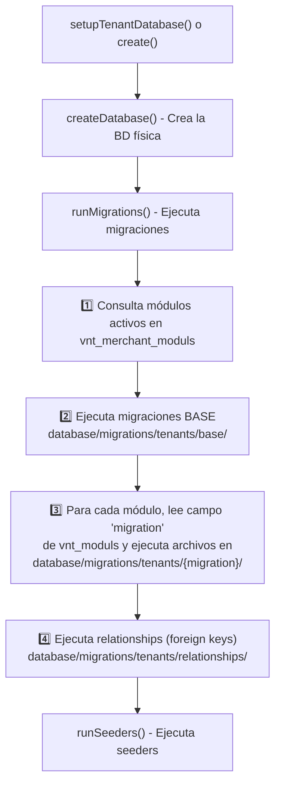

# 🔍 Evaluación del Sistema de Migraciones Multitenant

## Respuesta Principal: ¿Dónde se generan las migraciones?

El archivo **orquestador** que decide y ejecuta las migraciones es:

### 📌 [TenantManager.php](file:///c:/xampp/htdocs/tienda-multitenancy/app/Services/Tenant/TenantManager.php)

Este es el **cerebro del sistema**. El método clave es [`runMigrations()`](file:///c:/xampp/htdocs/tienda-multitenancy/app/Services/Tenant/TenantManager.php#L182-L536) (línea 182-536), que sigue este flujo:

---

## 📂 Estructura de Carpetas de Migraciones

### Migraciones CENTRALES (Base de datos principal)
📁 `database/migrations/` — **41 archivos**

Contiene tablas compartidas como: `users`, `tenants`, `user_tenants`, `sessions`, `vnt_companies`, `vnt_contacts`, `vnt_moduls`, `usr_profiles`, etc.

### Migraciones de TENANT (Base de datos por empresa)
📁 `database/migrations/tenants/` — **14 subcarpetas modulares**

| Carpeta | Archivos | Estado |
|---------|----------|--------|
| `base/` | 0 | ⚠️ **Vacía** - Se supone que tiene migraciones base obligatorias |
| `parameters/` | 8 | ✅ Configuraciones (opciones de empresa, impuestos, precios, etc.) |
| `sales/` | 10 | ✅ Ventas (cotizaciones, contactos, rutas, zonas, bodegas) |
| `inventory/` | 33 | ✅ Inventario (productos, stock, ajustes, traslados, etc.) |
| `production/` | 9 | ✅ Producción (órdenes, procesos, materiales) |
| `pettycash/` | 6 | ✅ Caja menor (pagos, conciliaciones) |
| `electronic invoice/` | 3 | ✅ Facturación electrónica |
| `relationships/` | 7 | ✅ Foreign keys (se ejecuta al final) |
| `accounting/` | 0 | ⚠️ **Vacía** |
| `crm/` | 0 | ⚠️ **Vacía** |
| `ecommerce/` | 0 | ⚠️ **Vacía** |
| `human_resources/` | 0 | ⚠️ **Vacía** |
| `shopping/` | 0 | ⚠️ **Vacía** |
| `reports/` | 0 | ⚠️ **Vacía** |

---

## 🔧 ¿Cómo decide qué migraciones ejecutar?

El flujo está en [TenantManager.php línea 213-218](file:///c:/xampp/htdocs/tienda-multitenancy/app/Services/Tenant/TenantManager.php#L213-L218):

1. Consulta la tabla `vnt_merchant_moduls` (relación merchant ↔ módulos)
2. Hace JOIN con `vnt_moduls` para obtener el campo **`migration`**
3. Filtra por el `merchant_type_id` del tenant y módulos con `status = 1`
4. El campo `migration` de cada módulo indica la **subcarpeta** dentro de `database/migrations/tenants/`

**Ejemplo:** Si el módulo "Inventario" tiene `migration = 'inventory'`, ejecutará todos los `.php` en `database/migrations/tenants/inventory/`.

---

## 📋 Otros Archivos Relevantes

| Archivo | Función |
|---------|---------|
| [StandardizeMigrations.php](file:///c:/xampp/htdocs/tienda-multitenancy/app/Console/Commands/StandardizeMigrations.php) | Comando artisan `migrate:standardize` que normaliza timestamps y nombres de campos |
| [MODULAR_TENANT_GUIDE.md](file:///c:/xampp/htdocs/tienda-multitenancy/documentacion/MODULAR_TENANT_GUIDE.md) | Documentación del sistema modular (referencia a `FlexibleTenantService` que **no existe** en el código) |

---

## ⚠️ Observaciones y Posibles Problemas

1. **`base/` está vacía** — El código busca migraciones base en esta carpeta (línea 246-256) pero no hay ningún archivo. Si hay tablas obligatorias, deberían estar aquí.

2. **`FlexibleTenantService` no existe** — La guía `MODULAR_TENANT_GUIDE.md` referencia un servicio que no está implementado. El servicio real es `TenantManager`.

3. **6 carpetas vacías** — `accounting`, `crm`, `ecommerce`, `human_resources`, `shopping` y `reports` están planificadas pero sin implementar.

4. **Nombre de carpeta con espacio** — `electronic invoice` tiene un espacio en el nombre, lo que podría causar problemas en algunos sistemas.

5. **`parameters` se agrega obligatoriamente** — El código (línea 226-238) valida que el módulo `parameters` siempre se incluya, incluso si no está en los módulos del merchant.
